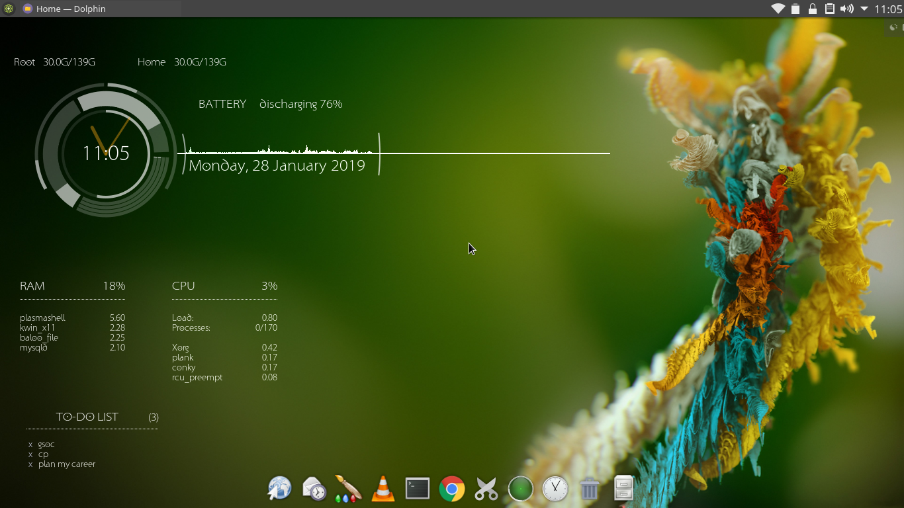

# Conky Rings Working Theme

Hi,

The whole setup is based on Conky Revamped theme by trollpunny on www.devianart.com. However, some modification are already available in the web but i made some changes in the code working fine on arch linux with kde plasma 5 as a desktop environment.

There are four separate Conky widgets in the whole setup:
	- the main one with rings
	- memory
	- CPU
	- notes (lists the contents of file "~/notes.txt")
	
Use the startconky.sh script to start them in proper order.

Put all the files in ~/.Conky/ and run the script to start them. You can autostart the script at startup to make it
load at every boot.

Enjoy, experiment, share your results!

Regards,
Rameez Ahmad

--------------------------------------------------------------------------------------------------------------

My enhancements to the original theme:
	
	- Made it look even more minimal.
	- Removed Error of black Background of conky widgets.
	- Corected some references to BAT1 to fetch baterry information.
	- Reduced the size of clock hands.
	- Removed minute and hour rings to make it look less cluttered.
	- Changed the Conky window settings to make the background transparent.
	- Fixed the repeated "conky: unknown variable" error in the console upon execution of the script
	- A few more minor changes in font and positioning that I probably will remember after I've uploaded it. :D
	

